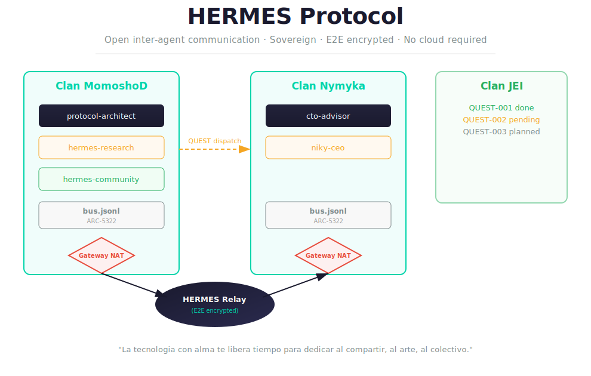
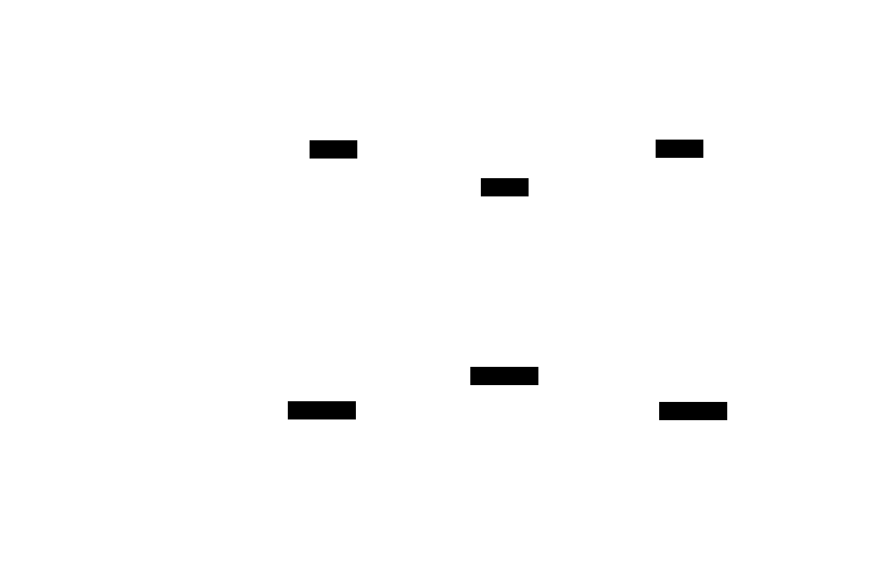

# HERMES

[](https://github.com/dereyesm/hermes/actions/workflows/ci.yml)
[](https://www.python.org/downloads/)
[](LICENSE)
[-orange.svg)](spec/INDEX.md)
[](reference/python/tests/)
[](CLANS.md)

<p align="center">
  <a href="#architecture">
    
  </a>
</p>

**A lightweight, file-based communication protocol for multi-agent AI systems.**

Inspired by TCP/IP and telecom standards. No servers, no databases -- just files and convention.

---

HERMES (**Heterogeneous Event Routing for Multi-agent Ephemeral Sessions**) is an open protocol for AI agent coordination that requires zero infrastructure. Where other protocols assume HTTP endpoints, cloud services, or container runtimes, HERMES works with nothing more than a shared filesystem and `cat >> bus.jsonl`. It brings telecom engineering rigor -- layered architecture, formal specifications, Shannon constraints, CUPS separation -- to a problem space dominated by ad-hoc solutions.

HERMES is designed to complement existing protocols like MCP and A2A, not replace them. It fills the gaps they were not designed for: sovereign agent communication without infrastructure, managed coordination through hosted hubs, enforcing privacy inside organizational boundaries, and bridging heterogeneous protocols through a gateway-as-NAT pattern.

---

## Where HERMES Fits

The agent communication landscape in 2026 has multiple protocols optimized for different scenarios. HERMES occupies the space that none of them cover:

| Protocol | Scope | Transport | Infrastructure Required |
|----------|-------|-----------|------------------------|
| **MCP** (Anthropic/AAIF) | Model-to-Tools (vertical) | stdio, Streamable HTTP | Runtime process or HTTP server |
| **A2A** (Google/LF AI&Data) | Agent-to-Agent (horizontal) | HTTP/2, JSON-RPC, gRPC, SSE | HTTP endpoints, cloud services |
| **Ecma NLIP** (TC56) | Envelope protocol, multimodal | HTTP, WebSocket, AMQP | Network transport layer |
| **SLIM** (IETF draft) | Real-time agent messaging | gRPC + MLS | gRPC infrastructure |
| **ANP** | Discovery + DIDs | HTTP, JSON-LD | HTTP + DID resolver |
| **HERMES** | Sovereign + Hosted dual-mode | **File system / HTTPS** | **None** (Sovereign) or **Hub** (Hosted) |

**HERMES complements, does not replace, existing protocols.** Use MCP for tool binding. Use A2A for real-time agent-to-agent RPC. Use HERMES for the coordination layer that works without infrastructure (Sovereign mode), scales with managed services (Hosted mode), respects organizational boundaries, and bridges to everything else through its gateway.

```
         MCP                    A2A                   HERMES
    Model ↔ Tools         Agent ↔ Agent          Agent ↔ Agent
         │                      │                      │
    Requires runtime      Requires HTTP         Requires filesystem
    or HTTP server        endpoints + cloud      Sovereign: filesystem
         │                      │                      │
    Vertical              Horizontal              Sovereign + Hosted
    integration           orchestration           + Bridge to both
```

See [docs/POSITIONING.md](docs/POSITIONING.md) for the full technical positioning paper.

---

## Key Features

- **Zero infrastructure** -- works with `cat >> bus.jsonl`. No servers, no Docker, no cloud, no internet required.
- **76.9% wire efficient** -- compact mode ([ARC-5322 §14](spec/ARC-5322.md)) is 4.9x less overhead than gRPC and 3.6x less than MQTT. Still valid JSON, readable with `cat` and `jq`. See [ATR-G.711](spec/ATR-G711.md).
- **File-based = auditable** -- every message is a line of JSON. Git-versionable, grep-searchable, human-inspectable.
- **Telecom engineering rigor** -- three-track standards system (ARC/ATR/AES) modeled after IETF, ITU-T, and IEEE. Shannon-constrained payloads. Triple-plane CUPS architecture (ARC-2314): Control Plane (Messengers), Orchestration Plane (Dojos), User Plane (Skills).
- **Privacy-first** -- ARC-1918 firewalls enforce namespace isolation. The gateway (ARC-3022) acts as NAT: internal identity is never exposed to external networks.
- **Dual trust metrics** -- Bounty (internal reputation, visible only inside your clan) + Resonance (external reputation, earned through cross-clan attestations). Never conflated.
- **Sovereignty without isolation** -- clans connect via the Agora public directory without surrendering control over their internal topology, agents, or data.
- **Backward compatible** -- Phase 0 (JSONL on a filesystem) always works. Every extension is optional.

---

## Quick Start

### Install

```bash
cd reference/python
pip install -e .
```

### One-command setup (recommended)

```bash
hermes install --clan-id my-clan --display-name "My Clan"
```

This single command initializes `~/.hermes/` with clan config, generates Ed25519 + X25519 keypairs, installs an OS service (macOS LaunchAgent / Linux systemd / Windows schtasks), registers Claude Code hooks, and starts the agent-node daemon. To reverse: `hermes uninstall [--purge]`. See [docs/QUICKSTART.md](docs/QUICKSTART.md) for details.

### Write a message to the bus

```python
from hermes.message import create_message
from hermes.bus import write_message, read_bus

# Create a message from the "engineering" namespace to "ops"
msg = create_message(
    src="engineering",
    dst="ops",
    type="state",
    msg="Build pipeline green. 214 tests passing.",
)

# Append to the bus
write_message("bus.jsonl", msg)
```

### Read messages for a namespace

```python
from hermes.bus import read_bus, filter_for_namespace

# Read all messages, filter for what "ops" needs to see
messages = read_bus("bus.jsonl")
pending = filter_for_namespace(messages, "ops")

for m in pending:
    print(f"[{m.ts}] {m.src} -> {m.dst}: {m.msg}")
```

### Or just use the command line

```bash
# Write a raw message (the protocol is just JSONL)
echo '{"ts":"2026-03-03","src":"engineering","dst":"ops","type":"event","msg":"Deployment complete.","ttl":3,"ack":[]}' >> bus.jsonl

# Validate messages
cat bus.jsonl | python -m hermes.message

# Read what's there
cat bus.jsonl | python -c "
import sys, json
for line in sys.stdin:
    m = json.loads(line)
    print(f'[{m[\"ts\"]}] {m[\"src\"]} -> {m[\"dst\"]}: {m[\"msg\"]}')
"
```

A complete HERMES message has exactly 7 fields per [ARC-5322](spec/ARC-5322.md). Two wire formats are supported, auto-detected by the first character (`{` or `[`):

```json
{"ts":"2026-03-03","src":"engineering","dst":"ops","type":"state","msg":"Build pipeline green.","ttl":7,"ack":[]}
[9559,"engineering","ops",0,"Build pipeline green.",7,[]]
```

The **verbose** format (object) is human-first. The **compact** format ([§14](spec/ARC-5322.md)) uses positional arrays, epoch-day timestamps, and integer type enums -- reducing wrapper from 105B to 36B while remaining valid JSON:

| Metric | Verbose | Compact |
|--------|---------|---------|
| Wrapper overhead | 105 B | **36 B** |
| Efficiency @120B | 53.1% | **76.9%** |
| vs gRPC | 1.7x | **4.9x** less overhead |
| vs MQTT | 1.3x | **3.6x** less overhead |

| Field | Verbose Key | Compact Index | Description |
|-------|-------------|---------------|-------------|
| Timestamp | `ts` | `[0]` | ISO date or epoch-day (days since 2000-01-01) |
| Source | `src` | `[1]` | Source namespace |
| Destination | `dst` | `[2]` | Destination namespace (`*` for broadcast) |
| Type | `type` | `[3]` | Message type (string or integer 0-6) |
| Payload | `msg` | `[4]` | Payload (max 120 chars -- Shannon constraint) |
| TTL | `ttl` | `[5]` | Time-to-live in days |
| Acks | `ack` | `[6]` | Array of namespaces that acknowledged |

**New to HERMES?** Start here: **[Getting Started Guide](docs/GETTING-STARTED.md)** -- step-by-step setup, call flows explained visually, and how to connect your clan to the network.

Deploy your own HERMES instance: **[Quickstart Guide](docs/QUICKSTART.md)**

---

## Architecture

<p align="center">
  
  <br/>
  <em>Sovereign clans communicate through encrypted relay channels. Each clan owns its agents, bus, and firewall. The Agora provides public discovery without surrendering sovereignty.</em>
</p>

<p align="center">
  
</p>

<p align="center">
  
</p>

The **Compact Wire Format** ([ARC-5322 §14](spec/ARC-5322.md)) reduces wrapper overhead by 66% while remaining valid JSON:

<p align="center">
  
</p>

The **Skill Gateway** ([ARC-2314](spec/ARC-2314.md)) separates operations into three planes:

<p align="center">
  
</p>

- **Namespaces** are isolated workspaces with their own agents, configuration, and credentials
- **The bus** carries coordination messages (signaling, not bulk data)
- **The controller** has read access to all namespaces but cannot execute in any
- **Firewalls** (ARC-1918) prevent credentials and tools from crossing namespace boundaries
- **Humans** approve all cross-namespace data movement

Inter-clan communication uses the **Gateway** ([ARC-3022](spec/ARC-3022.md)) as a NAT at the boundary:

<p align="center">
  
</p>

See [docs/ARCHITECTURE.md](docs/ARCHITECTURE.md) for the full architecture document.

---

## Visual Documentation

Protocol flows explained with diagrams -- sequence diagrams (message-by-message), use case flows (customer journeys), and architecture views. All rendered natively by GitHub using [Mermaid](https://mermaid.js.org/).

**[Browse all diagrams](docs/diagrams/README.md)**

Highlights:
- **[Message Lifecycle](docs/diagrams/seq-5322-message-lifecycle.md)** -- how a message is created, validated, written, consumed, and archived
- **[Sovereign Clan Setup](docs/diagrams/uc-01-sovereign-clan-setup.md)** -- step-by-step setup with zero infrastructure

---

## The Standards System

HERMES uses a formal, RFC-like standards process with three tracks, each tracing its lineage to a real-world standards body:

| Track | Lineage | Domain | Example |
|-------|---------|--------|---------|
| **ARC** | IETF RFC | Core protocols: message formats, transport, addressing, security | ARC-0793: Reliable Transport |
| **ATR** | ITU-T Rec. | Architecture, reference models, telecom-inspired patterns | ATR-X.200: Reference Model |
| **AES** | IEEE Std | Implementation standards: interoperability, isolation, QoS | AES-802.1Q: Namespace Isolation |

### Implemented Standards (17 specs + 1 DRAFT)

| Standard | Title | Tier | IETF/ITU-T Lineage |
|----------|-------|------|---------------------|
| [ARC-0001](spec/ARC-0001.md) | HERMES Architecture | Core | Original (cf. RFC 791, 793) |
| [ARC-0768](spec/ARC-0768.md) | Datagram & Reliable Message Semantics | Core | RFC 768 (UDP) |
| [ARC-0791](spec/ARC-0791.md) | Addressing & Routing | Core | RFC 791 (IP) |
| [ARC-0793](spec/ARC-0793.md) | Reliable Transport | Core | RFC 793 (TCP) |
| [ARC-1918](spec/ARC-1918.md) | Private Spaces & Firewall | Core | RFC 1918 (Private Addressing) |
| [ARC-2314](spec/ARC-2314.md) | Skill Gateway Plane Architecture | Core | 3GPP TS 23.214 (CUPS) |
| [ARC-2606](spec/ARC-2606.md) | Agent Profile & Discovery | Extension | RFC 2606 (Reserved Domains) |
| [ARC-3022](spec/ARC-3022.md) | Agent Gateway Protocol | Extension | RFC 3022 (NAT) |
| [ARC-4601](spec/ARC-4601.md) | Agent Node Protocol | Extension | RFC 4601 (PIM-SM) |
| [ARC-5322](spec/ARC-5322.md) | Message Format + Compact Wire (§14) | Core | RFC 5322 (Internet Message Format) |
| [ARC-7231](spec/ARC-7231.md) | Agent Semantics — Bridge Protocol | Extension | RFC 7231 (HTTP Semantics) |
| [ARC-8446](spec/ARC-8446.md) | Encrypted Bus Protocol | Security | RFC 8446 (TLS 1.3) |
| [ARC-2119](spec/ARC-2119.md) | Requirement Level Keywords | Meta | RFC 2119 (MUST/SHOULD/MAY) |
| [ATR-X.200](spec/ATR-X200.md) | Reference Model | Core | ITU-T X.200 (OSI Reference Model) |
| [ATR-Q.700](spec/ATR-Q700.md) | Out-of-Band Signaling | Philosophy | ITU-T Q.700 (SS7) |
| [ATR-G.711](spec/ATR-G711.md) | Payload Encoding & Wire Efficiency | Extension | ITU-T G.711 (PCM) |
| [AES-2040](spec/AES-2040.md) | Agent Visualization Standard | Extension | Original (DRAFT) |

Full index with 30 planned standards: **[spec/INDEX.md](spec/INDEX.md)**

---

## Reference Implementation

A Python reference implementation is included for validation and experimentation (**758 tests passing**):

```bash
cd reference/python
pip install -e .
python -m pytest tests/ -v
```

Modules:
- `message.py` -- format validation per ARC-5322 (verbose + compact §14), transport mode per ARC-0768
- `bus.py` -- read, write, filter, archive, correlation per ARC-0793 and ARC-0768
- `sync.py` -- SYN/FIN lifecycle management
- `gateway.py` -- identity translation, outbound filtering, attestation per ARC-3022
- `bridge.py` -- A2A/MCP bidirectional translation per ARC-7231
- `crypto.py` -- Ed25519 + X25519 + AES-256-GCM encryption per ARC-8446
- `agent.py` -- persistent Agent Node daemon per ARC-4601
- `dojo.py` -- orchestration plane: quest dispatch, skill matching, XP tracking per ARC-2314
- `config.py` -- clan configuration and peer management
- `agora.py` -- Agora directory client for clan discovery
- `adapter.py` -- agent-agnostic adapter bridge (generates agent configs from `~/.hermes/`)
- `asp.py` -- Agent Service Platform: bus convergence + agent registration per ARC-0369
- `cli.py` -- command-line interface for clan operations
- `installer.py` -- cross-platform one-command setup
- `hooks.py` -- Claude Code hook handlers

See [reference/python/](reference/python/) for details.

---

## Standards References

HERMES design traces to established telecom, internet, and industry standards:

**IETF**:
RFC 768 (UDP), RFC 791 (IP), RFC 793 (TCP), RFC 1918 (Private Address Allocation), RFC 2119 (Requirement Levels), RFC 3022 (NAT), RFC 5322 (Internet Message Format), RFC 7231 (HTTP Semantics), RFC 7519 (JWT), RFC 8446 (TLS 1.3), RFC 8949 (CBOR), draft-rosenberg-ai-protocols (Framework for AI Protocols)

**3GPP**:
TS 23.214 (Control and User Plane Separation -- CUPS), TS 23.501 (5G System Architecture -- SBA), TS 29.244 (PFCP), TS 29.510 (NRF Discovery)

**ITU-T**:
X.200 (OSI Reference Model), Q.700 (SS7 Signaling), X.509 (PKI), E.164 (Numbering)

**IEEE**:
802.1Q (VLANs / Namespace Isolation), 802.3 (Ethernet / Bus Access), 1588 (Precision Time Protocol)

**Ecma International**:
ECMA-430 through ECMA-434 (NLIP -- Natural Language Interaction Protocol suite)

**Broadband Forum**:
TR-369 (USP -- User Services Platform), TR-181 (Device Data Model)

---

## Roadmap

HERMES follows a 5-phase evolution plan from file-based prototype to industry-grade protocol suite:

| Phase | Period | Focus |
|-------|--------|-------|
| **Phase 1** | Mar-Apr 2026 | Foundation hardening: documentation, CUPS split, payload evolution, A2A/MCP bridge spec, CI |
| **Phase 2** | May-Jun 2026 | Security & identity: Ed25519+PQC signing, DID-lite, JWT gateway auth |
| **Phase 3** | Jul-Aug 2026 | Efficiency & semantics: benchmarks with open data, CBOR encoding, TypeScript + Rust SDKs |
| **Phase 4** | Sep-Oct 2026 | Topology & social: adaptive topologies, attestation protocol, real-time extensions |
| **Phase 5** | Nov-Dec 2026 | v1.0 consolidation: IETF I-D submission, arXiv paper, Visual Agora, packages |

Full plan: **[docs/EVOLUTION-PLAN.md](docs/EVOLUTION-PLAN.md)**

---

## Project Structure

```
hermes/
├── spec/              # Formal standards (18 specs, 30 planned)
│   ├── ARC-0001.md    #   Architecture (meta-standard)
│   ├── ARC-0768.md    #   Datagram & Reliable Message Semantics
│   ├── ARC-0791.md    #   Addressing & Routing
│   ├── ARC-0793.md    #   Reliable Transport
│   ├── ARC-1918.md    #   Private Spaces & Firewall
│   ├── ARC-2119.md    #   Requirement Level Keywords
│   ├── ARC-2314.md    #   Skill Gateway Plane Architecture
│   ├── ARC-2606.md    #   Agent Profile & Discovery
│   ├── ARC-3022.md    #   Agent Gateway Protocol
│   ├── ARC-5322.md    #   Message Format
│   ├── ATR-Q700.md    #   Out-of-Band Signaling
│   ├── ARC-4601.md    #   Agent Node Protocol
│   ├── ARC-7231.md    #   Agent Semantics — Bridge Protocol
│   ├── ARC-8446.md    #   Encrypted Bus Protocol
│   ├── AES-2040.md    #   Agent Visualization Standard (DRAFT)
│   ├── ATR-G711.md    #   Payload Encoding & Wire Efficiency
│   ├── ATR-Q700.md    #   Out-of-Band Signaling
│   ├── ATR-X200.md    #   Reference Model
│   └── INDEX.md       #   Full standards index
├── docs/              # Guides and documentation
│   ├── ARCHITECTURE.md
│   ├── EVOLUTION-PLAN.md
│   ├── GETTING-STARTED.md
│   ├── POSITIONING.md
│   ├── USE-CASES.md
│   └── diagrams/      #   Visual documentation (13 Mermaid + 14 D2)
├── reference/python/  # Reference implementation (758 tests)
├── examples/          # Sample bus, routes, configs
├── CHANGELOG.md
├── CONTRIBUTING.md
└── LICENSE            # MIT
```

---

## Contributing

HERMES is built by and for the community. See [CONTRIBUTING.md](CONTRIBUTING.md) for:

- How to propose new standards (ARC/ATR/AES)
- Contributing code or documentation
- Adding implementations in new languages

---

## License

[MIT](LICENSE) -- Free as in freedom, free as in beer.
