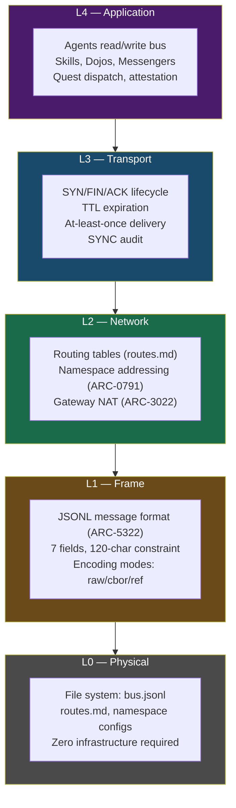

# ARCH-01: 5-Layer Protocol Stack

> The HERMES protocol stack from physical storage (L0) to application logic (L4), inspired by the OSI model.

## Architecture Diagram

## Layer Details

| Layer | Name | HERMES Spec | Responsibility | Analogy |
|:-----:|------|-------------|----------------|---------|
| **L4** | Application | ARC-2314 | Agent logic, quest dispatch, skill execution | HTTP, SMTP |
| **L3** | Transport | ARC-0793 | Session lifecycle, delivery guarantees, TTL | TCP |
| **L2** | Network | ARC-0791 | Addressing, routing, gateway NAT | IP |
| **L1** | Frame | ARC-5322 | Message format, validation, encoding | Ethernet frame |
| **L0** | Physical | ARC-0001 | File system storage, bus file | Physical wire |

## Key Design Points

- **Each layer is independent** — you can change the transport (L3) without affecting the message format (L1)
- **L0 is just files** — HERMES requires zero infrastructure beyond a filesystem
- **L3 adds reliability** — SYN/FIN/ACK provides session semantics over the append-only bus
- **L4 is where value lives** — the three-plane CUPS architecture operates here

## Referenced By

- [ATR-X.200: Reference Model](../../spec/ATR-X200.md) -- Formal 5-layer model
- [ARC-0001: HERMES Architecture](../../spec/ARC-0001.md) -- Architecture overview
- [docs/ARCHITECTURE.md](../ARCHITECTURE.md) -- Full architecture document
