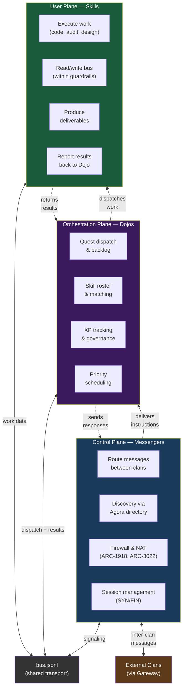

# ARCH-02: Triple-Plane Architecture (CUPS)

> Control Plane, Orchestration Plane, and User Plane — three separated concerns inspired by 3GPP CUPS.

## Architecture Diagram



## Plane Responsibilities

| Plane | Role | What It Does | What It NEVER Does |
|-------|------|-------------|-------------------|
| **Control (CP)** | Messenger | Routes messages, handles discovery, enforces firewall | Makes decisions, does work |
| **Orchestration (OP)** | Dojo | Assigns quests, tracks skills, manages XP | Delivers mail, writes code |
| **User (UP)** | Skills | Executes actual work, produces deliverables | Routes messages, assigns work |

## Why Three Planes?

In telecom (3GPP TS 23.214), CUPS separates the "brain" (control) from the "muscle" (user plane). HERMES adds a third plane — orchestration — because agent ecosystems need a conductor who decides **what work gets done, by whom, and when**.

```
Telecom CUPS:        HERMES CUPS:
  Control Plane        Control Plane (Messenger)
  User Plane           Orchestration Plane (Dojo)  ← NEW
                       User Plane (Skills)
```

## Referenced By

- [ARC-2314: Skill Gateway Plane Architecture](../../spec/ARC-2314.md)
- [ATR-X.200: Reference Model](../../spec/ATR-X200.md)
- [SEQ-2314: CUPS Quest Dispatch](seq-2314-cups-quest-dispatch.md)
