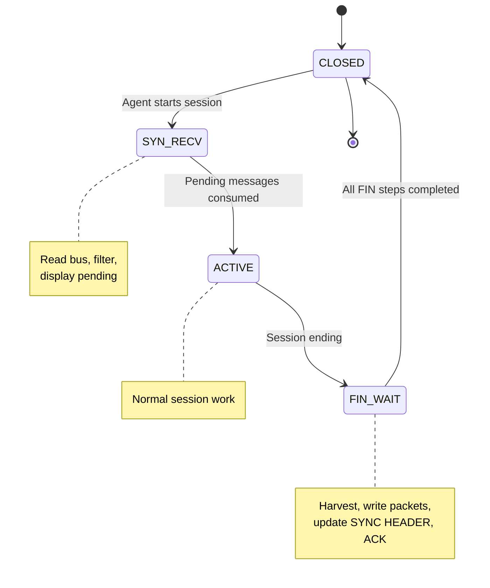

# SEQ-0793: Session Lifecycle

> How a HERMES session starts (SYN), operates (ACTIVE), ends (FIN), and gets audited (SYNC).

Modeled after TCP's connection management. Every session MUST execute SYN at start and FIN at close.

## Actors

| Actor | Role | Spec Reference |
|-------|------|----------------|
| **Agent** | Namespace operator — starts and ends sessions | ARC-0793 Section 3 |
| **Bus** | Shared JSONL transport | ARC-5322 |
| **SYNC Router** | Global consistency auditor — reads all, modifies nothing without approval | ARC-0793 Section 6 |
| **Human** | Approves all state-modifying operations | ARC-0793 Section 13.5 |

## Sequence Diagram

```mermaid
sequenceDiagram
    participant H as Human<br/>(operator)
    participant A as Agent<br/>(namespace X)
    participant B as Bus<br/>(bus.jsonl)
    participant S as SYNC Router
    participant AR as Archive

    Note over H,AR: Phase 1: SYN (Session Start)

    H->>A: Start session in namespace X
    A->>B: Read bus file
    B-->>A: All messages (JSONL)
    A->>A: Filter: (dst == X OR dst == "*")<br/>AND X NOT IN ack[]
    A->>A: Sort by ts ascending

    alt Pending messages found
        A-->>H: "[HERMES] N pending messages"
        loop Each message
            A->>A: Check: age > 3 days?
            alt Stale message
                A-->>H: "[STALE] from {src}, {age} days old"
            end
        end
    else No pending messages
        A-->>H: "[HERMES] No pending messages"
    end

    Note over A: State: CLOSED → SYN_RECV → ACTIVE

    Note over H,AR: Phase 2: ACTIVE (Session Work)

    H->>A: Normal work (reads, writes, computations)
    A->>B: May write new messages during session
    A->>B: May read bus for context

    Note over H,AR: Phase 3: FIN (Session End)

    H->>A: End session

    rect rgb(40, 40, 60)
        Note over A,B: Atomic FIN — all steps must complete
        A->>A: 1. Session harvest<br/>(what was built, decisions, insights)

        alt Session produced state changes
            A->>B: 2. Write new packets<br/>(ts, src=X, dst, type, msg, ttl, ack=[])
        end

        A->>A: 3. Update SYNC HEADER<br/>version++, last_sync=today,<br/>state=summary, pending_out/in

        A->>B: 4. ACK consumed messages<br/>(add X to each message's ack[])
    end

    Note over A: State: ACTIVE → FIN_WAIT → CLOSED

    Note over H,AR: Phase 4: SYNC (Periodic Audit)

    S->>B: Read full bus
    S->>S: Read all SYNC HEADERs

    loop Each namespace N
        S->>S: Compute actual pending_in<br/>vs reported pending_in
        alt Mismatch detected
            S-->>H: "Desync: N reports {X}, actual {Y}"
        end
    end

    loop Each message
        alt Expired (today > ts + ttl)
            S-->>H: "Expired: {ts} {src}→{dst}"
        end
        alt Orphan (age > 3, ack == [])
            S-->>H: "Orphan: unACKed {age} days"
        end
    end

    H->>S: Approve fixes
    S->>B: Update SYNC HEADERs
    S->>B: Write missing ACKs
    S->>AR: Archive expired messages
```

## State Machine

## Key Design Points

- **No session without SYN** — agents must read the bus before doing work
- **No exit without FIN** — even sessions with no state changes must complete FIN
- **Atomic FIN** — partial FIN leaves the system inconsistent (SYNC will detect it)
- **SYNC is read-only by default** — all corrections require human approval
- **At-least-once delivery** — if a crash occurs between consumption and ACK, the message is re-presented
- **Version monotonicity** — each FIN increments the SYNC HEADER version by exactly 1

## Referenced By

- [ARC-0793: Reliable Transport](../../spec/ARC-0793.md) -- Sections 3-6
- [docs/ARCHITECTURE.md](../ARCHITECTURE.md) -- Session lifecycle section
