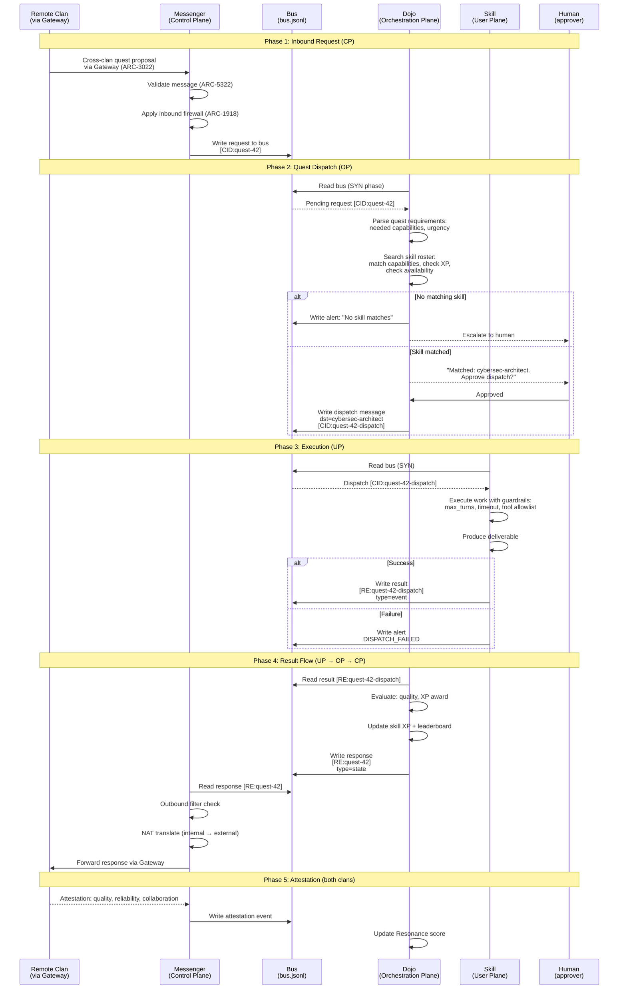
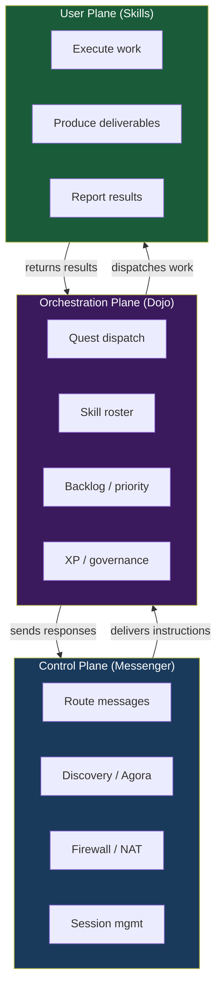

# SEQ-2314: CUPS Triple-Plane Quest Dispatch

> How a quest flows through the three planes: Control (Messenger), Orchestration (Dojo), and User (Skills).

Inspired by 3GPP CUPS (Control and User Plane Separation). Each plane has a distinct responsibility and clear boundaries.

## Actors

| Actor | Role | Plane | Spec Reference |
|-------|------|-------|----------------|
| **Messenger** | Routes messages, handles discovery | Control Plane (CP) | ARC-2314 Section 4 |
| **Dojo** | Dispatches quests, manages skill roster | Orchestration Plane (OP) | ARC-2314 Section 5 |
| **Skill** | Executes actual work | User Plane (UP) | ARC-2314 Section 6 |
| **Bus** | Shared transport | Transport | ARC-5322 |
| **Remote Clan** | External clan (via Gateway) | External | ARC-3022 |

## Sequence Diagram

## Three-Plane Architecture

## Key Design Points

- **Separation of concerns** — each plane can evolve independently
- **Messenger never does work** — it only routes and filters
- **Dojo never delivers mail** — it only assigns and evaluates
- **Skills never route messages** — they only execute and report
- **Human-in-the-loop** — quest dispatch requires human approval
- **Dual reputation** — Bounty (internal XP) + Resonance (external attestations)
- **CUPS boundary** — like 3GPP's PFCP interface between control and user planes

## Referenced By

- [ARC-2314: Skill Gateway Plane Architecture](../../spec/ARC-2314.md) -- Sections 4-6
- [ATR-X.200: Reference Model](../../spec/ATR-X200.md) -- Layer model
- [docs/GETTING-STARTED.md](../GETTING-STARTED.md) -- "The Three Planes"
