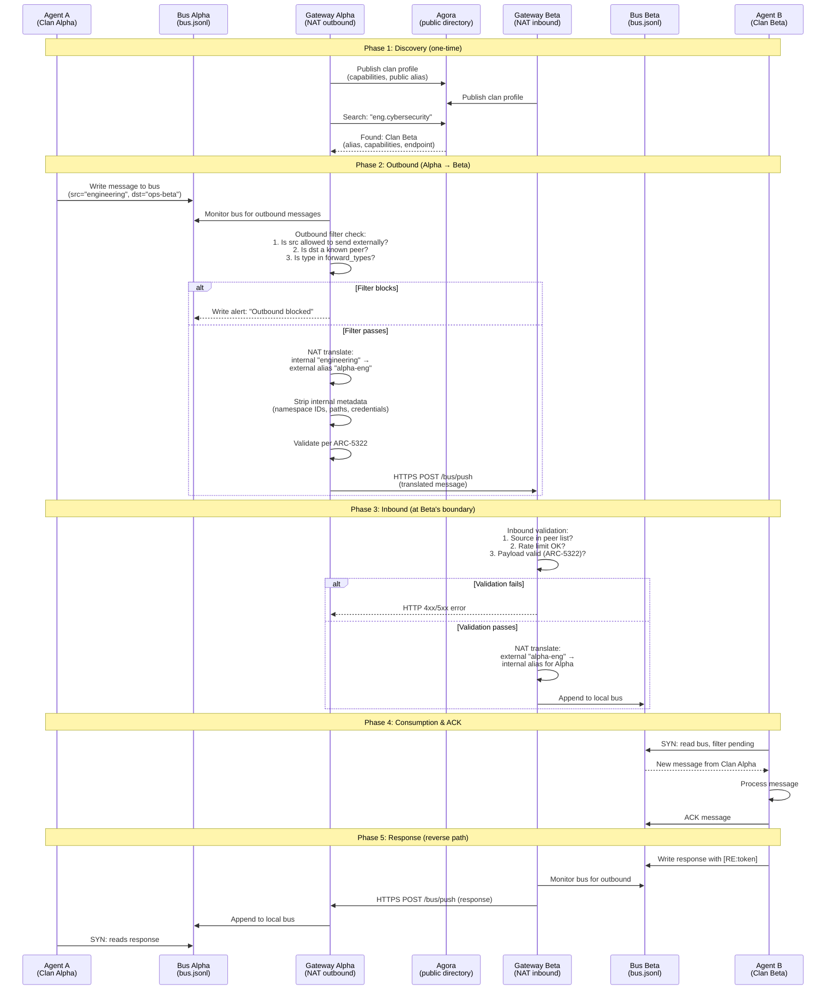

# SEQ-3022: Gateway Cross-Clan Communication

> How a message travels from one clan to another through the Gateway NAT boundary, hop by hop.

The Gateway is the membrane between sovereign clans. It translates identity, filters traffic, and never exposes internal structure.

## Actors

| Actor | Role | Spec Reference |
|-------|------|----------------|
| **Agent A** | Source namespace inside Clan Alpha | ARC-5322 |
| **Gateway Alpha** | Clan Alpha's boundary — outbound filter + NAT | ARC-3022 Sections 7-8 |
| **Agora** | Public directory for clan discovery | ARC-2606 |
| **Gateway Beta** | Clan Beta's boundary — inbound validation | ARC-3022 Sections 8 |
| **Agent B** | Destination namespace inside Clan Beta | ARC-5322 |

## Sequence Diagram

## Key Design Points

- **Gateway-as-NAT** — internal namespace names are NEVER exposed externally
- **Default-deny outbound** — only whitelisted types/destinations pass the filter
- **Sovereignty preserved** — each clan controls its own firewall rules independently
- **Bidirectional** — responses flow back through the same boundary in reverse
- **CID/RE correlation** — `[CID:token]` and `[RE:token]` link request to response across clans
- **HTTPS required** — inter-gateway transport is always encrypted in transit

## Referenced By

- [ARC-3022: Agent Gateway Protocol](../../spec/ARC-3022.md) -- Sections 4-8
- [ARC-2606: Agent Profile & Discovery](../../spec/ARC-2606.md) -- Agora directory
- [docs/GETTING-STARTED.md](../GETTING-STARTED.md) -- "How Two Clans Communicate"
