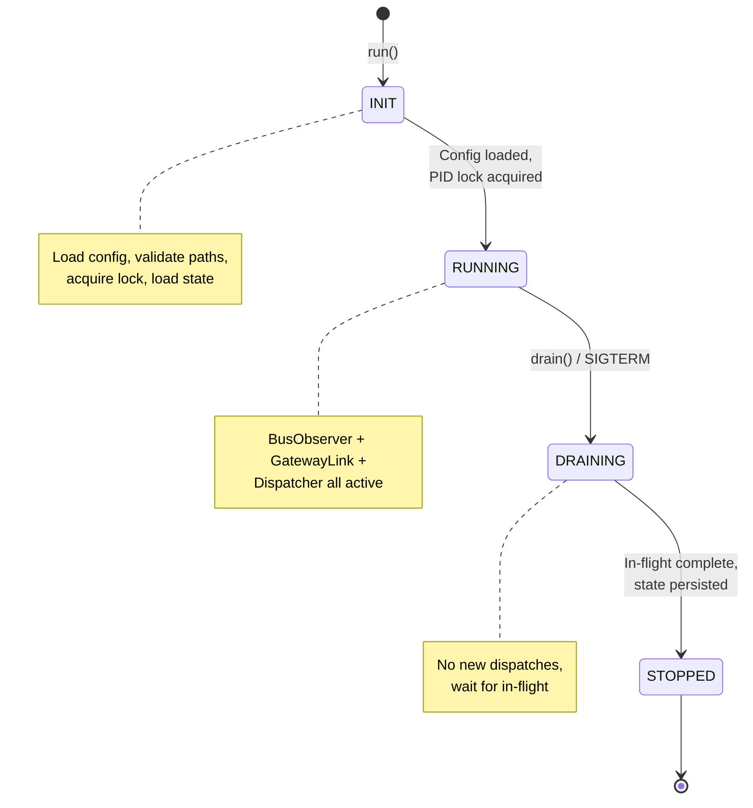

# SEQ-4601: Agent Node Protocol

> How the persistent Agent Node daemon observes the bus, links to the gateway, and dispatches sub-agents — all in parallel.

The Agent Node bridges ephemeral sessions and continuous operation. Three async tasks run simultaneously.

## Actors

| Actor | Role | Spec Reference |
|-------|------|----------------|
| **BusObserver** | Watches bus.jsonl for new messages (kqueue/poll) | ARC-4601 Section 5 |
| **GatewayLink** | SSE inbound + HTTP POST outbound + heartbeat | ARC-4601 Section 6 |
| **MessageEvaluator** | Decides: dispatch, escalate, forward, or ignore | ARC-4601 Section 7.2 |
| **Dispatcher** | Spawns sub-agent processes with guardrails | ARC-4601 Section 7 |
| **StateManager** | PID lock, state persistence, recovery | ARC-4601 Section 8 |
| **Remote Gateway** | Cloud endpoint (SSE + HTTP) | ARC-3022 |

## Sequence Diagram

```mermaid
sequenceDiagram
    participant SM as StateManager
    participant BO as BusObserver<br/>(kqueue/poll)
    participant BUS as bus.jsonl
    participant ME as MessageEvaluator
    participant GL as GatewayLink<br/>(SSE + HTTP)
    participant GW as Remote Gateway
    participant DP as Dispatcher<br/>(subprocess)

    Note over SM,GW: Phase 1: Startup (INIT → RUNNING)

    SM->>SM: Load gateway.json config
    SM->>SM: Acquire PID lock (atomic mkdir)
    SM->>SM: Load state file (if exists)<br/>Resume from stored bus_offset

    par Three parallel async tasks
        Note over BO,BUS: Task 1: Bus Observation
        BO->>BUS: Watch file (kqueue/inotify/poll)

        Note over GL,GW: Task 2: Gateway Link
        GL->>GW: Connect SSE /events<br/>(exponential backoff on failure)

        Note over ME: Task 3: Evaluation Cycle
        Note over ME: Runs every 300s (configurable)
    end

    Note over SM,GW: Phase 2: Steady State (RUNNING)

    rect rgb(30, 50, 40)
        Note over BO,BUS: Bus Observer detects change
        BUS-->>BO: File modified (new bytes)
        BO->>BO: Read from offset 1234<br/>to new end 1500<br/>(offset-based tail)
        BO->>BO: Parse new JSON lines
        BO->>BO: Classify each message:<br/>NewMessage | StaleAlert | skip
        BO->>ME: Emit classified events
    end

    rect rgb(40, 30, 50)
        Note over GL,GW: Gateway Link receives inbound
        GW-->>GL: SSE event (new message)
        GL->>GL: Validate per ARC-5322
        GL->>GL: Dedup check (src+ts+msg)
        GL->>BUS: Append valid message to bus
    end

    rect rgb(50, 40, 30)
        Note over GL,GW: Heartbeat (every 60s)
        GL->>GW: POST /heartbeat<br/>{node_id, ts, bus_lines,<br/>dispatch_slots, uptime}
    end

    Note over SM,GW: Phase 3: Message Evaluation

    ME->>ME: Evaluate pending messages

    alt type=dispatch, dst matches node
        ME->>DP: DISPATCH
        DP->>DP: Acquire slot (max 2)
        DP->>DP: Spawn subprocess<br/>(claude -p "payload"<br/>--max-turns 10<br/>--allowedTools "...")
        alt Exit 0 (success)
            DP->>BUS: Write event [RE:CID] with summary
        else Exit non-zero
            DP->>BUS: Write alert DISPATCH_FAILED
        else Timeout (300s)
            DP->>BUS: Write alert DISPATCH_TIMEOUT
        end
    else type=alert, age > 4h, unacked
        ME->>GL: ESCALATE → forward with flag
        ME->>BUS: Write alert ESCALATION
    else type=request
        ME->>GL: ESCALATE → requires human
    else type=event, dst is external
        ME->>GL: FORWARD via HTTP POST
        GL->>GW: POST /bus/push
        ME->>BUS: ACK with node namespace
    else Already ACKed or type=state
        Note over ME: IGNORE
    end

    Note over SM,GW: Phase 4: Shutdown (DRAINING → STOPPED)

    SM->>SM: Receive SIGTERM
    SM->>DP: Stop accepting new dispatches
    SM->>DP: Wait for in-flight dispatches<br/>(with timeout)
    SM->>SM: Persist state to file<br/>(atomic: write .tmp → rename)
    SM->>SM: Release PID lock
    Note over SM: State: DRAINING → STOPPED
```

## State Machine

## Key Design Points

- **Three parallel tasks** — BusObserver, GatewayLink, and Dispatcher run concurrently via asyncio
- **Offset-based tail** — the observer never re-reads the entire bus, only new bytes
- **Heartbeat is out-of-band** — it's HTTP, NOT a bus message (transport-layer signal)
- **Dispatch guardrails** — max slots, timeout, tool allowlist, max turns
- **Graceful shutdown** — DRAINING state waits for in-flight dispatches before exit
- **Recovery** — on startup, if prior PID is dead, resume from stored bus_offset

## Referenced By

- [ARC-4601: Agent Node Protocol](../../spec/ARC-4601.md) -- Sections 4-8
- [ARC-2314: CUPS Architecture](../../spec/ARC-2314.md) -- Control Plane
