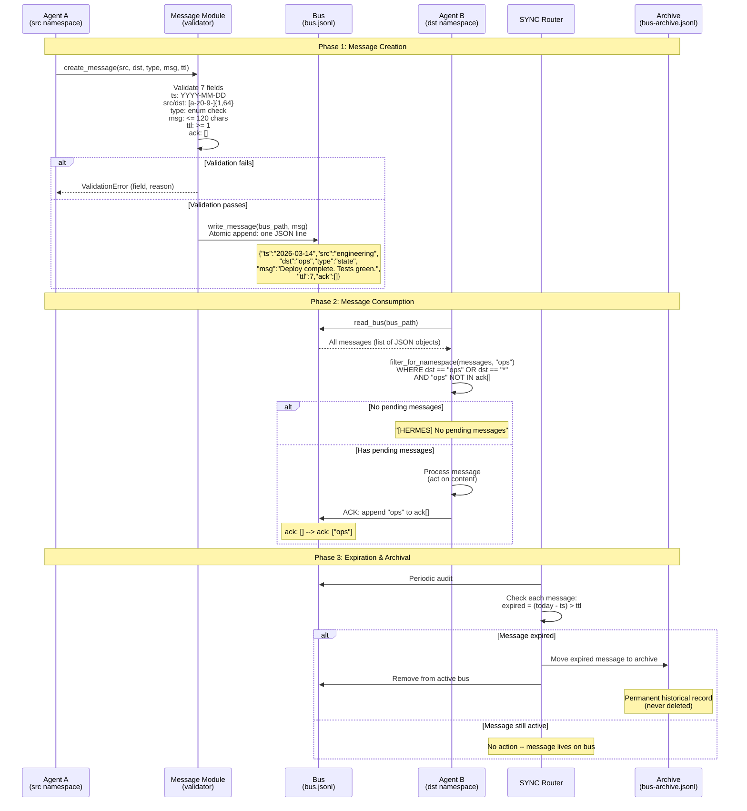

# SEQ-5322: Message Lifecycle

> How a HERMES message is created, validated, written to the bus, consumed, acknowledged, and eventually archived.

This is the foundational flow -- every other protocol operation builds on this sequence.

## Actors

| Actor | Role | Spec Reference |
|-------|------|----------------|
| **Agent A** | Source namespace -- creates and sends the message | ARC-5322 Section 9.1 |
| **Message Module** | Validates the 7-field format and constraints | ARC-5322 Section 10 |
| **Bus** | Shared JSONL file -- the transport medium | ARC-5322 Section 3 |
| **Agent B** | Destination namespace -- reads and processes the message | ARC-5322 Section 9.2 |
| **SYNC Router** | Global auditor -- detects expired messages | ARC-0793 Section 6 |
| **Archive** | Historical storage for expired messages | ARC-0793 Section 7.4 |

## Sequence Diagram

## Step-by-Step Explanation

### Phase 1: Message Creation

1. **Agent A** calls `create_message()` with the 7 required fields
2. **Message Module** validates every field against ARC-5322 constraints:
   - `ts` must be a valid `YYYY-MM-DD` date, not in the future
   - `src` must be 1-64 lowercase alphanumeric/hyphen characters
   - `dst` must be a valid namespace or `"*"` for broadcast, and cannot equal `src`
   - `type` must be one of: `state`, `alert`, `event`, `request`, `data_cross`, `dispatch`, `dojo_event`
   - `msg` must be 1-120 characters (for `raw` encoding), no control characters
   - `ttl` must be a positive integer >= 1
   - `ack` must be an empty array `[]` at creation time
3. If validation fails, the error is returned with the specific field and reason
4. If validation passes, the message is **atomically appended** as a single JSON line to `bus.jsonl`

### Phase 2: Message Consumption

5. **Agent B** reads the entire bus file
6. Messages are **filtered** for relevance: destination matches Agent B's namespace (or is broadcast `"*"`), and Agent B has not already acknowledged the message
7. If there are pending messages, Agent B processes them and **appends its namespace ID** to the `ack[]` array
8. The `ack` update is the delivery receipt -- it ensures the message won't be presented again

### Phase 3: Expiration & Archival

9. The **SYNC Router** periodically audits the bus
10. For each message, it checks: `current_date > date(ts) + ttl days`
11. Expired messages are **moved** (not deleted) to the archive file (`bus-archive.jsonl`)
12. The archive is a permanent record -- HERMES never deletes messages

## Key Design Points

- **Atomicity**: one message = one JSON line = one topic (ARC-5322 Section 8.1)
- **Shannon constraint**: 120-character limit forces precision over verbosity (Section 6)
- **At-least-once delivery**: if a crash occurs between consumption and ACK, the message will be re-presented (ARC-0793 Section 9)
- **Human-in-the-loop**: archiving expired messages requires human approval (ARC-0793 Section 13.5)

## Referenced By

- [ARC-5322: Message Format](../../spec/ARC-5322.md) -- Sections 3, 4, 9, 10
- [ARC-0793: Reliable Transport](../../spec/ARC-0793.md) -- Sections 6, 7
- [docs/ARCHITECTURE.md](../ARCHITECTURE.md) -- Message lifecycle section
