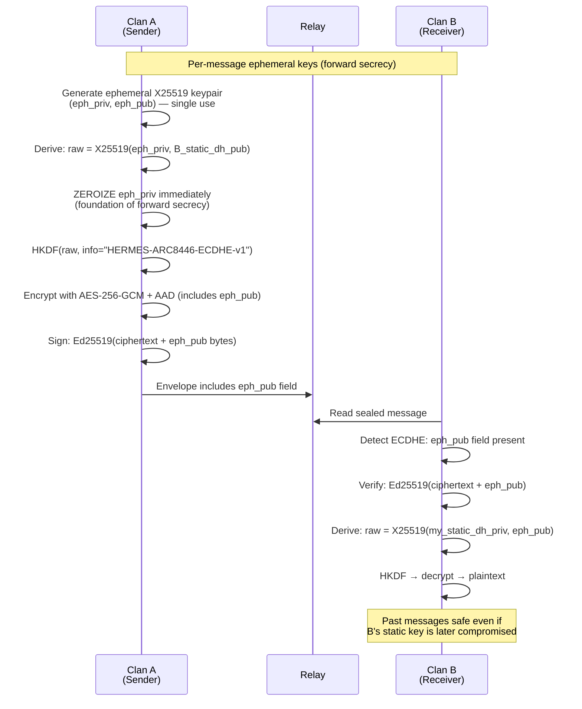

# SEQ-8446: Crypto Seal & Open

> How two clans establish encrypted communication: key bootstrap, message sealing (encrypt+sign), and message opening (verify+decrypt).

Inspired by TLS 1.3's verify-before-decrypt pattern. Uses Ed25519 (sign) + X25519 (DH) + AES-256-GCM (encrypt).

## Actors

| Actor | Role | Spec Reference |
|-------|------|----------------|
| **Clan A** | Sender — seals messages | ARC-8446 Section 6 |
| **Clan B** | Receiver — opens messages | ARC-8446 Section 7 |
| **Relay** | Shared untrusted storage (e.g., private Git repo) | ARC-8446 Section 8 |

## Sequence Diagram

```mermaid
sequenceDiagram
    participant A as Clan A<br/>(Sender)
    participant R as Relay<br/>(untrusted storage)
    participant B as Clan B<br/>(Receiver)

    Note over A,B: Phase 1: Key Bootstrap (one-time)

    A->>A: Generate Ed25519 keypair (sign)<br/>Generate X25519 keypair (DH)
    B->>B: Generate Ed25519 keypair (sign)<br/>Generate X25519 keypair (DH)

    A->>R: Publish keys/<clan_a>.pub<br/>(ed25519_pub + x25519_pub + fingerprints)
    B->>R: Publish keys/<clan_b>.pub<br/>(ed25519_pub + x25519_pub + fingerprints)

    A->>B: In-person fingerprint verification<br/>sign: 2a37:fb25:...<br/>dh: 44da:1a4f:...
    B->>A: In-person fingerprint verification<br/>sign: 65bf:b893:...<br/>dh: 7cc6:ef39:...

    Note over A,B: Trust established (TOFU model)

    Note over A,B: Phase 2: Seal Message (Sender)

    A->>A: 1. Derive shared secret:<br/>raw = X25519(my_dh_priv, B_dh_pub)
    A->>A: 2. HKDF-SHA256:<br/>key = HKDF(raw, info="HERMES-ARC8446-v1")
    A->>A: 3. Generate 12-byte random nonce
    A->>A: 4. Construct AAD:<br/>canonical_json({dst, src, ts, type})
    A->>A: 5. Encrypt:<br/>ciphertext = AES-256-GCM(key, nonce, plaintext, aad)
    A->>A: 6. Sign ciphertext:<br/>sig = Ed25519.sign(my_sign_priv, ciphertext_bytes)
    A->>A: 7. Assemble envelope:<br/>{ciphertext, nonce, signature, sender_sign_pub}
    A->>R: Write to relay/<clan_a>_outbox.jsonl

    Note over A,B: Phase 3: Open Message (Receiver)

    B->>R: Read relay/<clan_a>_outbox.jsonl
    R-->>B: Sealed message envelope

    rect rgb(60, 30, 30)
        Note over B: CRITICAL: Verify BEFORE decrypt
        B->>B: 1. Verify signature:<br/>Ed25519.verify(A_sign_pub, ciphertext, sig)<br/>Using pre-established key, NOT envelope key!
    end

    alt Signature invalid
        Note over B: REJECT — do not decrypt
    else Signature valid
        B->>B: 2. Derive shared secret:<br/>raw = X25519(my_dh_priv, A_dh_pub)<br/>(symmetric property: same result)
        B->>B: 3. HKDF-SHA256:<br/>key = HKDF(raw, info="HERMES-ARC8446-v1")
        B->>B: 4. Reconstruct AAD from envelope metadata
        B->>B: 5. Decrypt:<br/>plaintext = AES-256-GCM.decrypt(key, nonce, ciphertext, aad)
        B->>B: 6. UTF-8 decode plaintext
        Note over B: Message opened successfully
    end
```

## ECDHE Forward Secrecy (Optional)

## Key Design Points

- **Verify-before-decrypt** — signature check happens BEFORE any decryption attempt (TLS 1.3 pattern)
- **Identity substitution defense** — receiver verifies against pre-established keys, NOT the envelope's `sender_sign_pub`
- **AAD binding** — envelope metadata (src, dst, ts, type) is cryptographically bound to ciphertext
- **HKDF domain separation** — `info` parameter prevents cross-protocol key confusion
- **ECDHE forward secrecy** — ephemeral private key is zeroized immediately after DH derivation
- **Nonce registry** — receivers track nonces to prevent replay attacks
- **TOFU trust model** — fingerprints verified in person, suitable for small-clan model

## Referenced By

- [ARC-8446: Encrypted Bus Protocol](../../spec/ARC-8446.md) -- Sections 4-9, 11.2
- [docs/CLAN-DANI-ALIGNMENT.md](../CLAN-DANI-ALIGNMENT.md) -- Fingerprint exchange with Clan JEI
