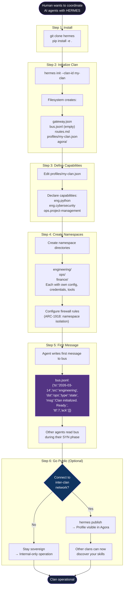

# UC-01: Sovereign Clan Setup

> A single human sets up a sovereign HERMES clan with multiple agent namespaces, zero infrastructure required.

This is the entry point for any new HERMES user. By the end of this flow, you have a working clan that can communicate internally and is ready to connect to the inter-clan network.

## Actors

| Actor | Role |
|-------|------|
| **Human** | Clan sovereign -- approves all decisions |
| **CLI** | `hermes` command-line tool |
| **Filesystem** | Local storage -- the only infrastructure needed |
| **Agora** | Public directory for clan discovery (optional) |

## Use Case Flow



## Step-by-Step Explanation

### Step 1: Install

Clone the HERMES repository and install the Python reference implementation. This gives you the `hermes` CLI and the protocol library.

```bash
git clone https://github.com/dereyesm/hermes.git
cd hermes/reference/python
pip install -e .
```

### Step 2: Initialize Clan

Run `hermes init` to create your clan workspace. This generates the minimum viable file structure -- a bus file, a routing table, a gateway config, and a profile.

```bash
hermes init --clan-id my-clan --display-name "My Clan"
```

**Zero infrastructure**: everything is local files. No servers, no databases, no Docker.

### Step 3: Define Capabilities

Edit your clan profile (`profiles/my-clan.json`) to declare what your skills can do. Capabilities use the ARC-2606 taxonomy -- a hierarchical namespace like `eng.cybersecurity` or `ops.project-management`.

This is your clan's **passport** -- it tells other clans what you can offer.

### Step 4: Create Namespaces

Organize your agents into **namespaces** -- isolated workspaces with their own credentials, tools, and data. The ARC-1918 firewall ensures that credentials never cross namespace boundaries.

```
my-clan/
├── engineering/    (code, tests, deploys)
├── ops/            (monitoring, infra)
├── finance/        (budgets, billing)
├── bus.jsonl       (shared signaling)
└── routes.md       (routing table)
```

### Step 5: First Message

Write your first message to the bus. This is the moment HERMES comes alive -- agents can now coordinate through the shared bus file.

```bash
hermes send --to ops --type state --msg "Clan initialized. All systems ready."
```

Other agents discover this message during their **SYN phase** (ARC-0793).

### Step 6: Go Public (Optional)

If you want to collaborate with other clans, publish your profile to the **Agora** -- the public directory where clans discover each other.

```bash
hermes publish
```

This is optional. You can run a fully sovereign clan that never connects to the outside world. The protocol works the same either way.

## What You End Up With

```
my-clan/
├── gateway.json            # Gateway config (for inter-clan, if needed)
├── bus.jsonl                # Your message bus (the heart of HERMES)
├── routes.md                # Routing table (namespace -> namespace)
├── profiles/
│   └── my-clan.json         # Your public profile (capabilities, display name)
├── agora/                   # Local cache of Agora directory
├── engineering/             # Namespace: isolated workspace
│   ├── config.json          #   Namespace configuration
│   └── ...                  #   Tools, credentials, memory
├── ops/                     # Namespace: isolated workspace
└── finance/                 # Namespace: isolated workspace
```

## Key Design Points

- **Sovereign by default**: no external dependencies, no cloud, no internet required
- **Namespace isolation**: ARC-1918 firewalls prevent credential/tool leakage between namespaces
- **Human-in-the-loop**: the human approves all cross-namespace data transfers
- **Progressive disclosure**: start internal-only, publish to Agora when ready
- **File-based = auditable**: every message is a line of JSON, git-versionable, grep-searchable

## Referenced By

- [docs/GETTING-STARTED.md](../GETTING-STARTED.md) -- Full setup walkthrough
- [ARC-5322: Message Format](../../spec/ARC-5322.md) -- Message structure
- [ARC-1918: Private Spaces & Firewall](../../spec/ARC-1918.md) -- Namespace isolation
- [ARC-2606: Agent Profile & Discovery](../../spec/ARC-2606.md) -- Profile taxonomy
- [ARC-0793: Reliable Transport](../../spec/ARC-0793.md) -- SYN/FIN lifecycle
