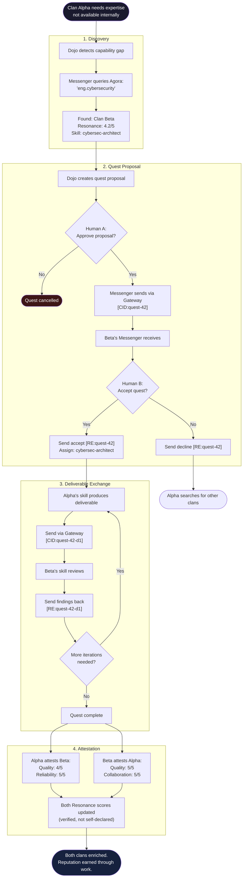

# UC-02: Cross-Clan Collaboration

> Two independent clans discover each other through the Agora, propose a quest, exchange deliverables, and build reputation.

This is the core value proposition of HERMES: sovereign clans collaborating without surrendering control.

## Actors

| Actor | Role |
|-------|------|
| **Clan Alpha** | Needs a service (e.g., security audit) |
| **Clan Beta** | Provides the service (e.g., cybersec expertise) |
| **Agora** | Public directory where clans find each other |
| **Human A** | Clan Alpha's operator — approves all decisions |
| **Human B** | Clan Beta's operator — approves all decisions |

## Use Case Flow

## Key Design Points

- **Both humans approve** — no autonomous cross-clan action
- **Sovereignty preserved** — internal data, skills, and processes stay private
- **Reputation earned** — Resonance comes from verified cross-clan attestations, not self-declaration
- **CID/RE correlation** — every message in the sequence is traceable via tokens
- **Gateway-as-NAT** — internal namespace names never cross the boundary

## Referenced By

- [docs/GETTING-STARTED.md](../GETTING-STARTED.md) -- "How Two Clans Communicate"
- [docs/USE-CASES.md](../USE-CASES.md) -- Use Case #3
- [ARC-3022: Agent Gateway Protocol](../../spec/ARC-3022.md)
