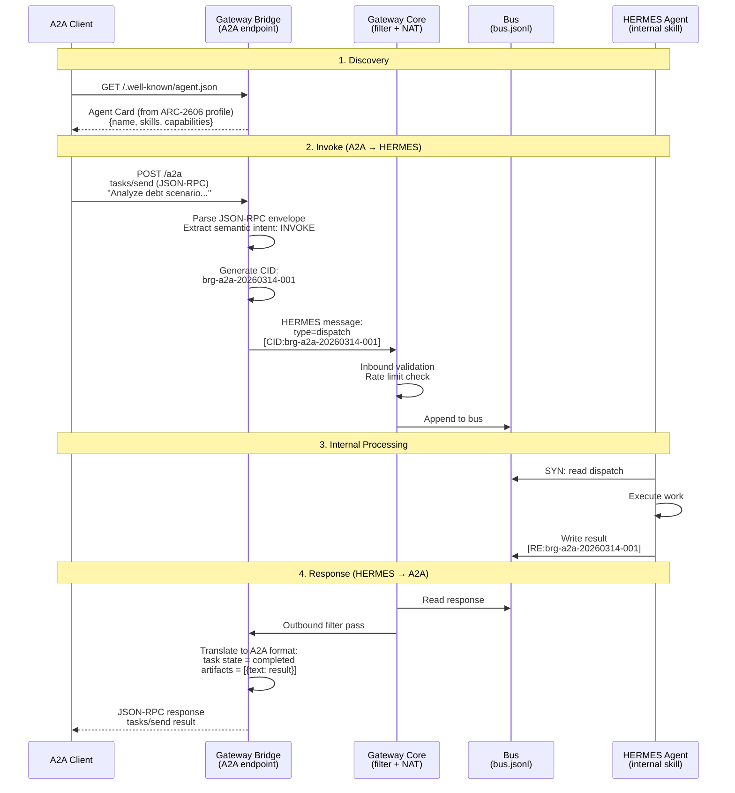
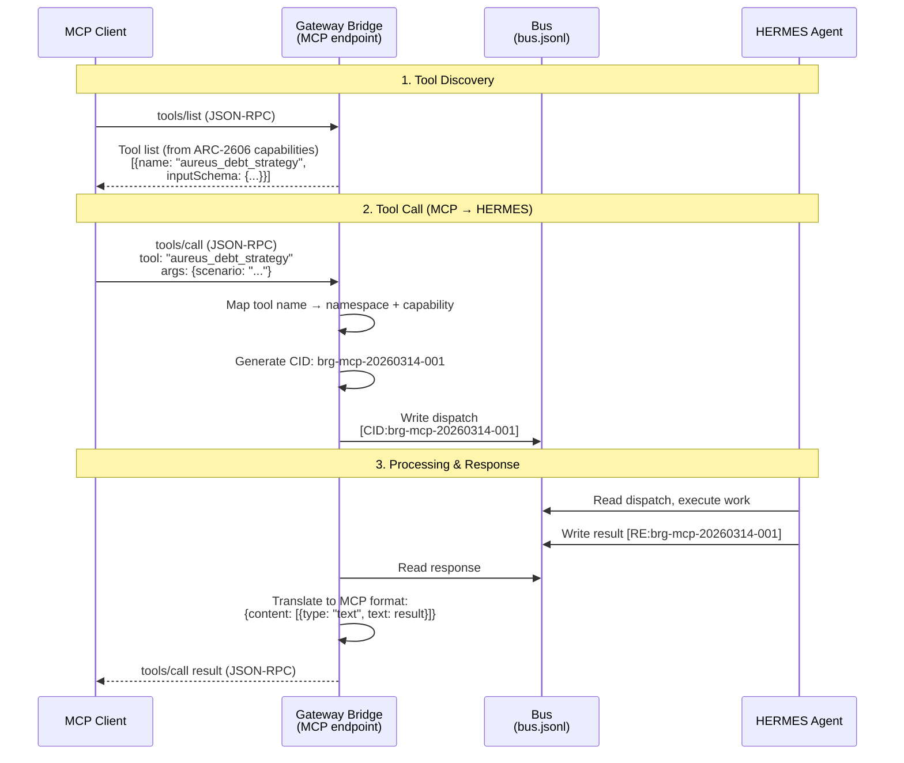
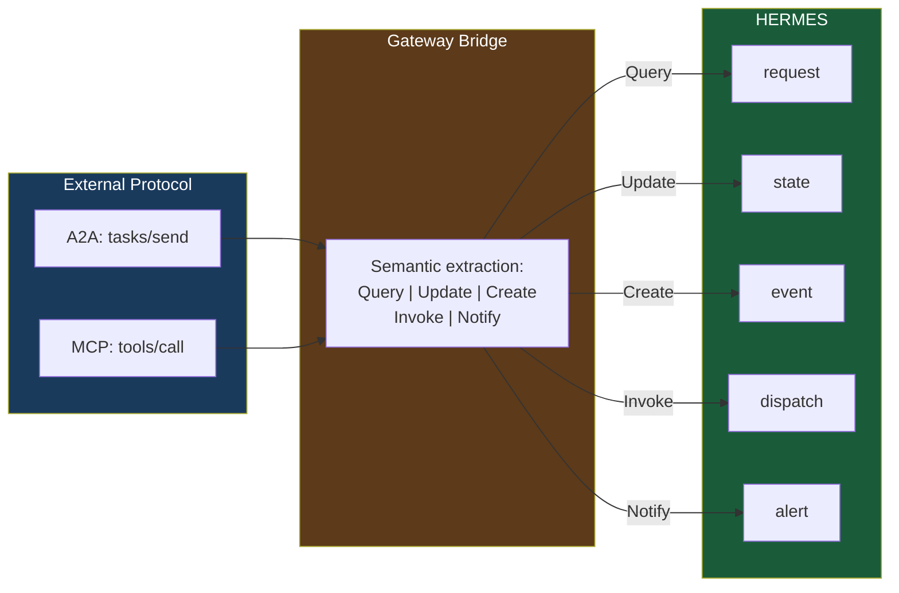

# UC-03: Bridge from A2A/MCP to HERMES

> How an external A2A agent or MCP client interacts with a HERMES clan through the Gateway Bridge.

HERMES doesn't replace A2A or MCP — it bridges to them. The Gateway translates protocol semantics bidirectionally.

## Actors

| Actor | Role |
|-------|------|
| **A2A Client** | External agent using Google A2A protocol |
| **MCP Client** | External tool using Anthropic MCP protocol |
| **Gateway Bridge** | Translates between external protocol and HERMES JSONL |
| **HERMES Agent** | Internal skill behind the gateway |

## Bridge Flow — A2A

## Bridge Flow — MCP

## Unified Operation Semantics

## Key Design Points

- **Bidirectional** — external protocols can call HERMES agents AND HERMES agents can call external ones
- **Semantic preservation** — operation intent (Query, Invoke, Notify, etc.) is maintained across translation
- **Identity isolation** — internal namespace names are NEVER exposed through bridge endpoints
- **CID correlation** — bridge-generated CIDs track the full request/response lifecycle
- **Rate limiting** — bridge has independent rate limits on top of gateway limits
- **Optional** — a HERMES deployment without a bridge is fully functional

## Referenced By

- [ARC-7231: Agent Semantics](../../spec/ARC-7231.md) -- Sections 3-6
- [ARC-3022: Agent Gateway Protocol](../../spec/ARC-3022.md) -- Gateway architecture
