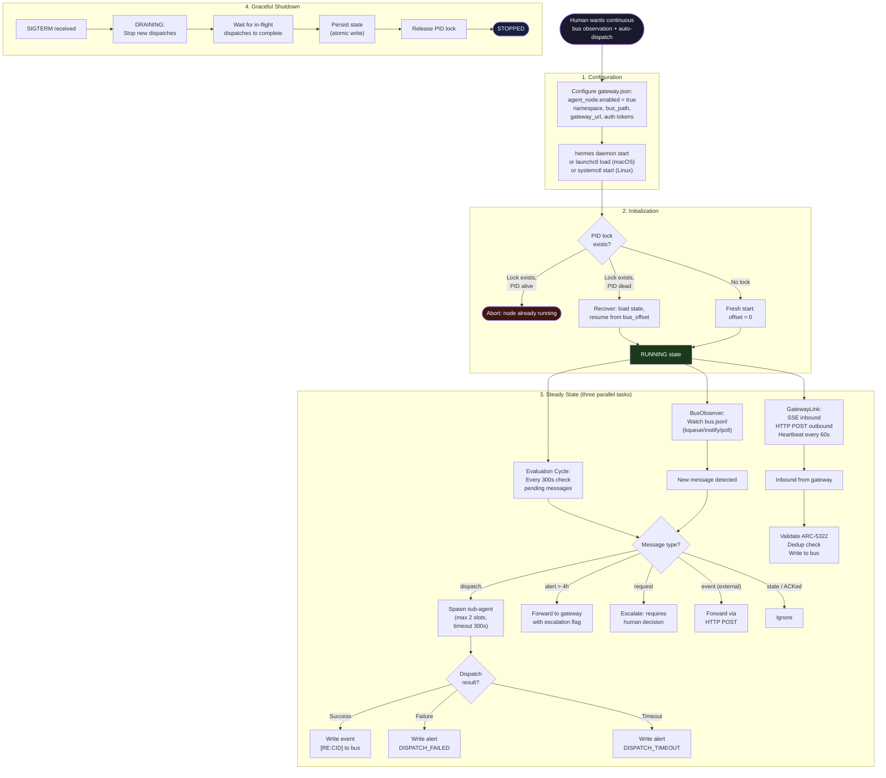

# UC-04: Agent Node Daemon Lifecycle

> How the Agent Node starts, operates continuously, handles events, and shuts down gracefully.

The Agent Node is the persistent counterpart to ephemeral sessions — it keeps your clan alive between human interactions.

## Use Case Flow

## Key Design Points

- **Zero-to-running**: configure `gateway.json`, run one command
- **Three parallel tasks**: BusObserver + GatewayLink + Evaluator run concurrently
- **Dispatch guardrails**: max slots, timeout, tool allowlist — prevents runaway agents
- **Graceful shutdown**: DRAINING state ensures in-flight work completes
- **Recovery**: stale PID lock is reclaimed, bus_offset resumes from stored state
- **Process manager friendly**: `--foreground` flag works with launchd, systemd, Docker

## Referenced By

- [ARC-4601: Agent Node Protocol](../../spec/ARC-4601.md) -- Full specification
- [SEQ-4601: Agent Node Sequence](seq-4601-agent-node.md) -- Detailed message flow
