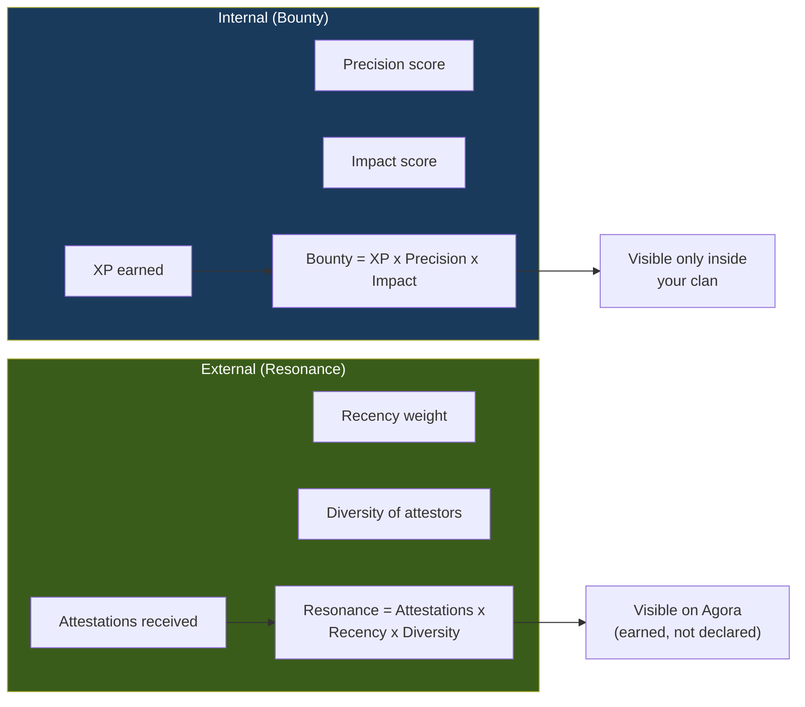

# UC-05: Quest Dispatch Lifecycle

> The full journey of a quest: from need identification to skill matching, execution, evaluation, and reputation update.

Quests are how work gets done in HERMES — whether internal or cross-clan.

## Use Case Flow

```mermaid
flowchart TD
    START([Need identified:<br/>"We need a security audit"]) --> ORIGIN

    ORIGIN{"Internal skill<br/>available?"}
    ORIGIN -->|Yes| INTERNAL["Dojo matches<br/>from local roster"]
    ORIGIN -->|No| EXTERNAL["Dojo instructs Messenger<br/>to search Agora"]

    subgraph search ["Discovery (if external)"]
        EXTERNAL --> AGORA["Query Agora:<br/>'eng.cybersecurity'"]
        AGORA --> CANDIDATES["Candidates found<br/>(ranked by Resonance)"]
        CANDIDATES --> SELECT["Human selects clan"]
        SELECT --> PROPOSAL["Send quest proposal<br/>via Gateway [CID:quest-X]"]
        PROPOSAL --> PEER{"Peer clan<br/>accepts?"}
        PEER -->|No| NEXT["Try next candidate"]
        PEER -->|Yes| ASSIGN_EXT["Peer assigns their skill"]
    end

    subgraph dispatch ["Dispatch"]
        INTERNAL --> ASSIGN_INT["Dojo assigns local skill"]
        ASSIGN_EXT --> DISPATCH
        ASSIGN_INT --> DISPATCH

        DISPATCH["Write dispatch to bus<br/>dst = assigned skill<br/>[CID:quest-X-dispatch]"]
    end

    subgraph execution ["Execution (User Plane)"]
        DISPATCH --> SKILL["Skill receives dispatch"]
        SKILL --> WORK["Execute with guardrails:<br/>max_turns: 10<br/>timeout: 300s<br/>allowed_tools: [...]"]
        WORK --> OUTCOME{"Result?"}
        OUTCOME -->|Success| RESULT["Write event<br/>[RE:quest-X-dispatch]"]
        OUTCOME -->|Failure| FAILED["Write alert<br/>DISPATCH_FAILED"]
        OUTCOME -->|Timeout| TIMEOUT["Write alert<br/>DISPATCH_TIMEOUT"]
    end

    subgraph evaluation ["Evaluation (Orchestration Plane)"]
        RESULT --> EVAL["Dojo evaluates result:<br/>quality, completeness"]
        FAILED --> RETRY{"Retry<br/>available?"}
        TIMEOUT --> RETRY
        RETRY -->|Yes| DISPATCH
        RETRY -->|No| ESCALATE["Escalate to human"]

        EVAL --> XP["Award XP to skill<br/>Update leaderboard"]
        XP --> BOUNTY["Update Bounty<br/>(internal reputation)"]
    end

    subgraph attestation ["Attestation (if cross-clan)"]
        BOUNTY --> CROSS{"Cross-clan<br/>quest?"}
        CROSS -->|No| DONE([Quest complete])
        CROSS -->|Yes| ATTEST["Mutual attestation<br/>Quality + Reliability +<br/>Collaboration scores"]
        ATTEST --> RESONANCE["Update Resonance<br/>(external reputation)"]
        RESONANCE --> DONE
    end

    style START fill:#1a1a2e,color:#fff
    style DONE fill:#16213e,color:#fff
    style ESCALATE fill:#5c3a1a,color:#fff
```

## Dual Reputation System



## Key Design Points

- **Need-driven** — quests start from a real need, not arbitrary task assignment
- **Capability matching** — Dojo matches skills by capability taxonomy + XP threshold
- **Guardrails** — execution is bounded by turns, timeout, and tool allowlist
- **Dual reputation** — Bounty (internal, private) + Resonance (external, public)
- **Retry logic** — failed dispatches can be retried before escalating to human
- **Attestation = peer review** — reputation earned through verified collaboration

## Referenced By

- [ARC-2314: CUPS Architecture](../../spec/ARC-2314.md) -- Orchestration Plane
- [docs/GETTING-STARTED.md](../GETTING-STARTED.md) -- "Set Up Your Dojo"
- [docs/USE-CASES.md](../USE-CASES.md) -- Use Case #3
